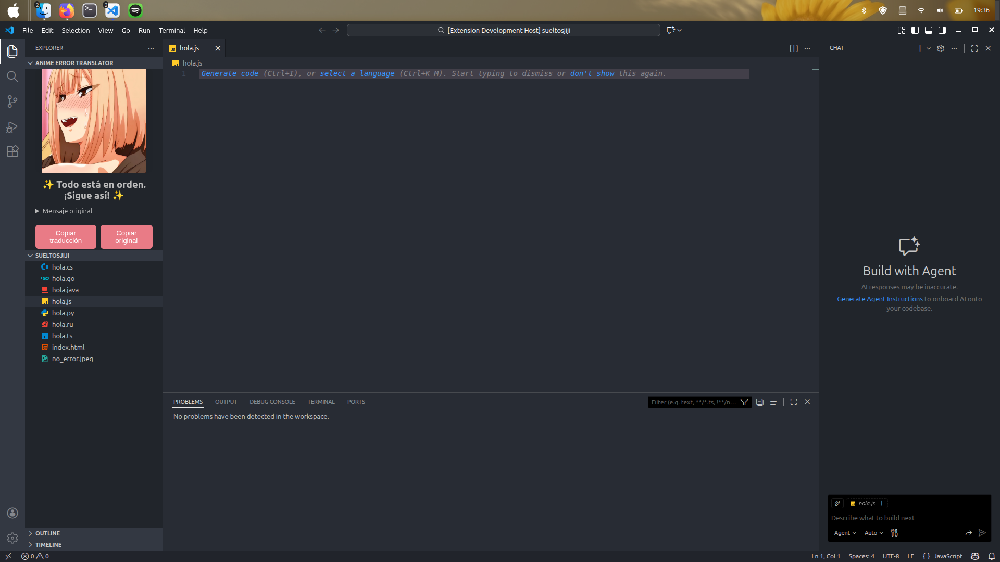
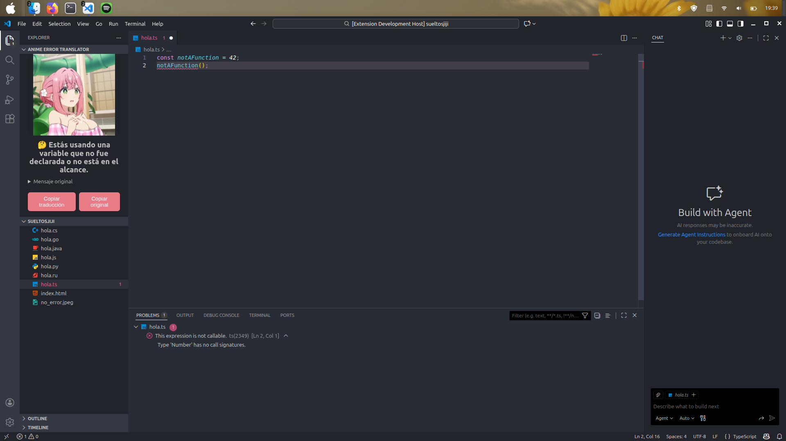
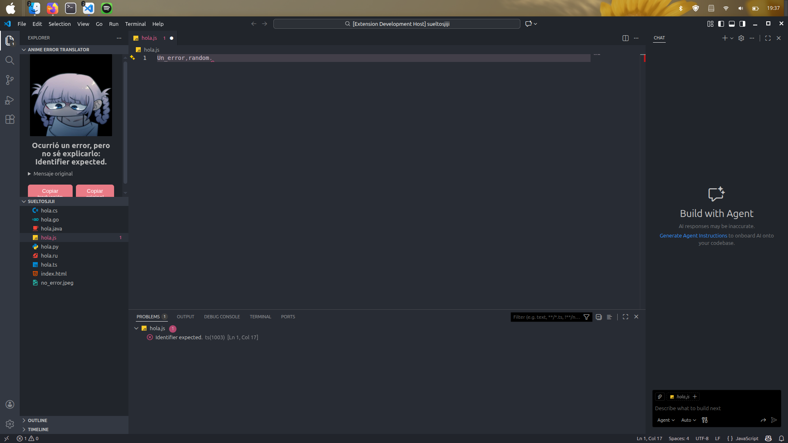

# Anime Error Translator 🐾

Traduce mensajes de error técnicos a explicaciones más amigables y las muestra en una vista lateral (Webview) con imágenes representativas para ayudarte a entender rápidamente qué pasó y cómo empezar a arreglarlo.

---

## Características

- Traducción de errores comunes (JavaScript/TypeScript) a mensajes fáciles de entender.
- Cobertura inicial para Python, Java, Go, Rust y C#.
- Vista lateral (Webview) que muestra la traducción, el mensaje original y una imagen contextual.

---

## Capturas

### Captura sin Errores en tu código



---

### Captura con errores de "Esta no es una función"



---

### Captura de un error desconocido



---

## 📦 Instalación y desarrollo

- Requisitos: Node.js (>=18), npm, (opcional) Git para crear ramas/PRs.
- Instalar dependencias y compilar:

```bash
npm install
npm run compile
```

- Ejecutar tests (usa la infraestructura de tests de VS Code):

```bash
npm test
```

- Ejecutar la extensión en modo desarrollo: abrir la carpeta en VS Code y presionar F5.

---

## 🛠️ Uso y comandos importantes

- `Anime Error Translator: Mostrar errores desconocidos` — abre una lista rápida con los mensajes desconocidos recogidos en la sesión.

---

## ⚠️ Known issues / Limitaciones

- El mapeo de errores se basa en heurísticas (regex/substring/orden de patterns). Es posible tener falsos positivos; por eso las sugerencias generadas deben revisarse manualmente.
- Los tests corren en el host de pruebas de VS Code; requerir directamente `vscode` desde node fuera del host falla (comportamiento esperado).

---

## 👥 Contribuir

Si quieres colaborar:
- Añade mappings nuevos editando `src/extension.ts` (update `ERROR_LIST`) con pruebas unitarias y abre un PR para revisión.
- Mejora `ERROR_LIST` en `src/extension.ts` para añadir patterns útiles.
- Proporciona imágenes en `media/` con licencia compatible (o tus propias imágenes en configuración).
- Abre PRs y describe los cambios y su motivación.

## 📬 Contacto y Apoyo

Si quieres reportar bugs o colaborar, sígueme en:

[Twitter](https://x.com/NaoSenpaii) | [Instagram](https://www.instagram.com/naosenpaii/) | [GitHub](https://github.com/Nao-Senpaii)

Además si gustas apoyarme, eres libre de ofrecerme un cafecito en [Ko-Fi](https://ko-fi.com/naosenpai).

---

## 📝 Licencia

Este proyecto usa la [Licencia MIT](./LICENSE).


## Release Notes

### 1.0.0

Versión inicial de Anime Error Translator. Pendiente de errores y bugs.